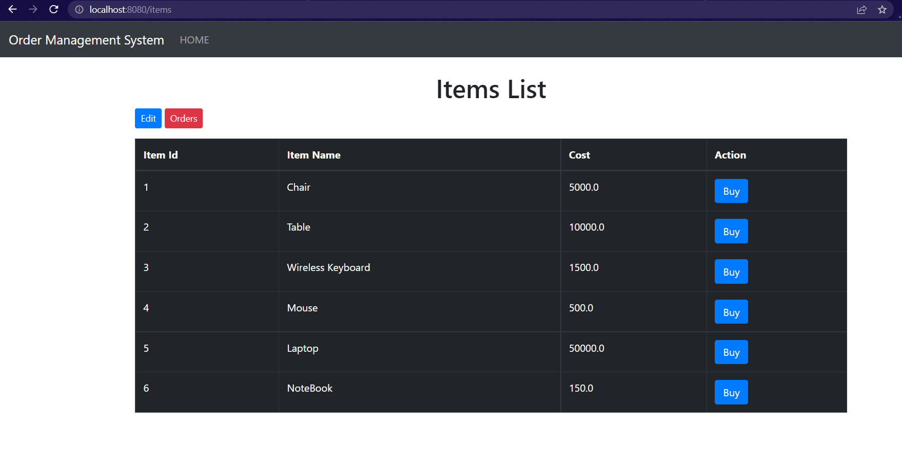
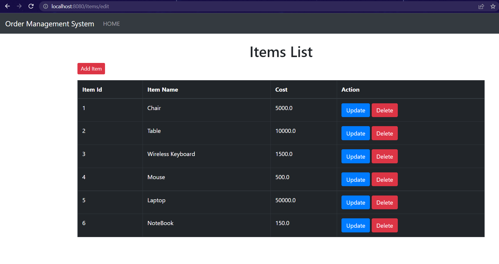
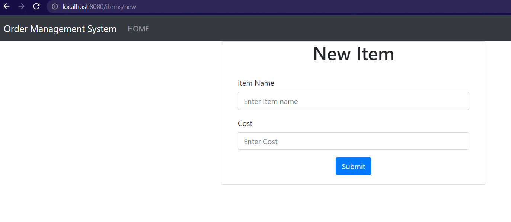
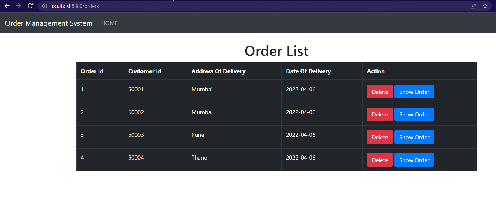

# Order Management System
It is a simple Spring Boot project to maintain order details.


## Items
### List Of All Items
#### Request

```http
  http://localhost:8080/items
```
#### Response


### Edit Items
#### Request
```http
  http://localhost:8080/items/edit
```
#### Response


### New item
#### Request
```http
   http://localhost:8080/items/new
```
#### Response


### Delete item
#### Request
```http
  DELETE /items/{id}
```

| Parameter | Type     | Description                       |
| :-------- | :------- | :-------------------------------- |
| `itemId`      | `Integer` | Deletes items from database with specified Id. |


## Orders
### List of all orders
#### Request
```http
  http://localhost:8080/orders
```

#### Response


